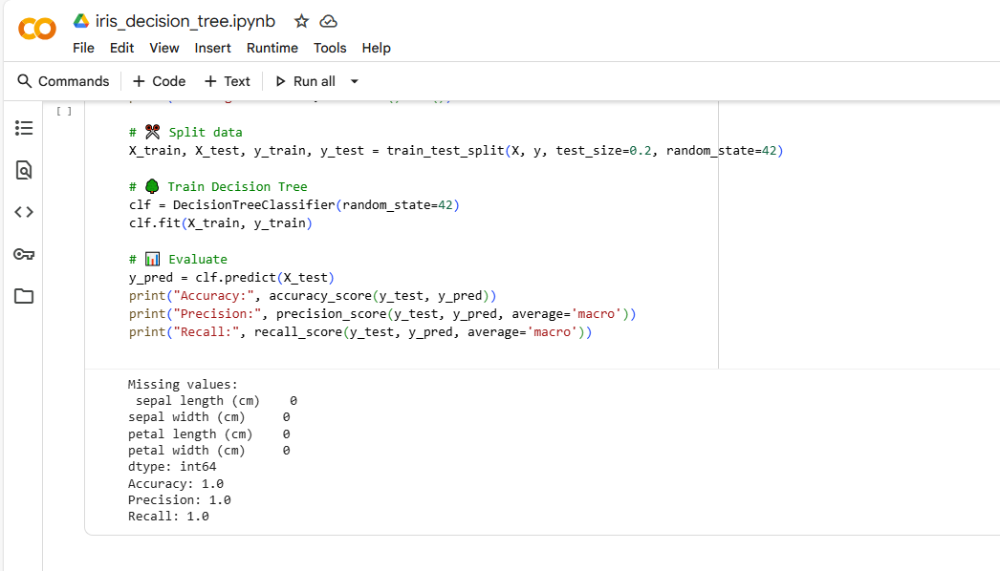
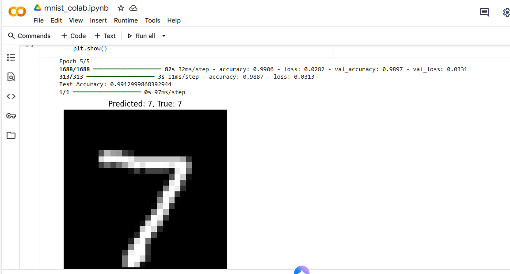
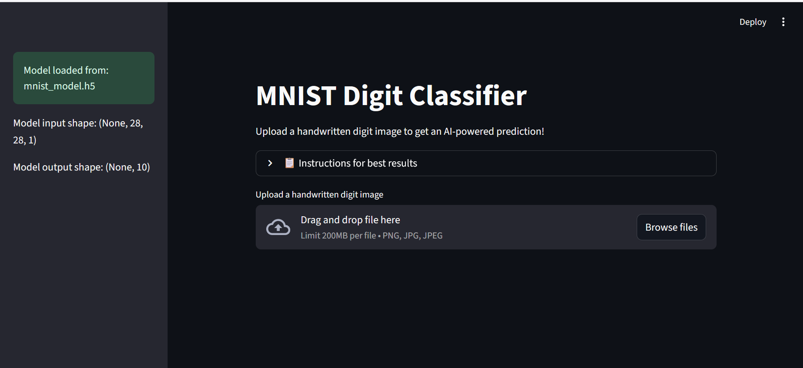
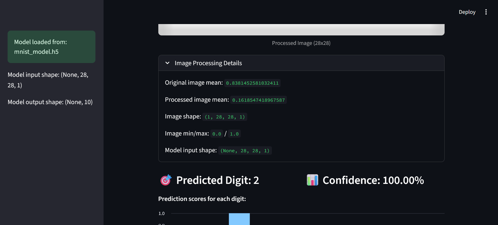
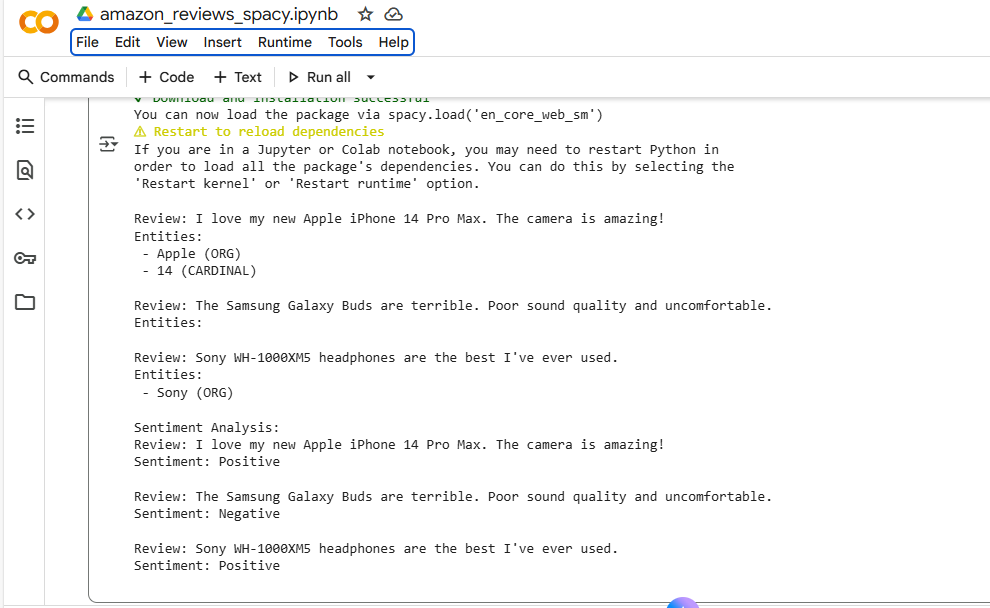
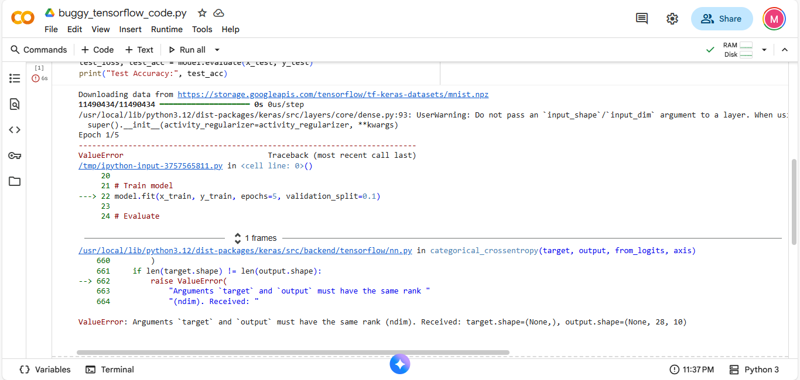
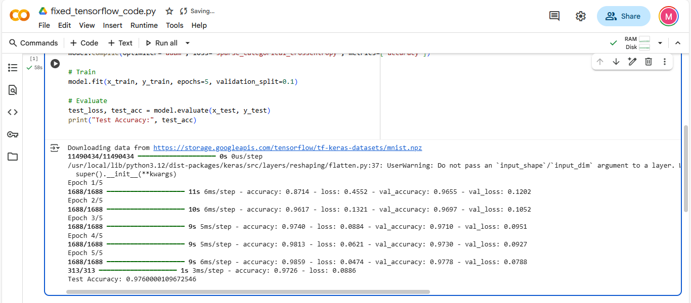

# 🤖 AI Tools Practical - Machine Learning Portfolio

A comprehensive collection of AI and machine learning projects demonstrating various techniques and tools including classical ML, deep learning, NLP, and debugging skills.

## 📋 Table of Contents

- [Project Overview](#-project-overview)
- [Project Structure](#-project-structure)
- [Tasks Overview](#-tasks-overview)
- [Screenshots](#-screenshots)
- [Technologies Used](#-technologies-used)
- [Getting Started](#-getting-started)
- [Live Demo](#-live-demo)
- [Video Link](#-video-link)
- [Report](#-report)
- [Group Members](#-group-members)
- [Contributing](#-contributing)

## 🎯 Project Overview

This repository contains four main AI/ML tasks that showcase different aspects of machine learning:

1. **Classical Machine Learning** - Iris dataset classification using Decision Trees
2. **Deep Learning** - MNIST digit classification with TensorFlow/Keras and Streamlit deployment
3. **Natural Language Processing** - Amazon reviews analysis using spaCy
4. **Debugging** - TensorFlow code debugging and optimization

## 📁 Project Structure

```
AI-tools-practical/
├── task1_classicalml/
│   └── iris_decision_tree.ipynb          # Decision tree classification
├── task2_deep_learning/
│   └── streamlit_app/
│       ├── app.py                        # Streamlit web application
│       ├── mnist_model.h5               # Trained TensorFlow model
│       ├── requirements.txt             # Dependencies
│       └── README.md                    # App documentation
├── task3_nlp/
│   └── amazon_reviews_spacy.ipynb       # NLP analysis with spaCy
├── task4_debugging/
│   ├── buggy_tensorflow_code.py         # Original buggy code
│   └── fixed_tensorflow_code.py         # Debugged and optimized code
├── screenshots/                          # Project screenshots
│   ├── iris_decision_tree.png
│   ├── mnist_colab.png
│   ├── streamlit_app.png
│   ├── streamlit_app_result_example.png
│   ├── amazon_reviews_spaCy.png
│   ├── buggy_tensorflow_code.png
│   └── fixed_tensorflow_code.png
└── report
└── README.md                            # This file
```

## 🚀 Tasks Overview

### Task 1: Classical ML - Iris Dataset Classification
**File:** `task1_classicalml/iris_decision_tree.ipynb`

- **Objective:** Classify iris flowers into three species using decision trees
- **Dataset:** Scikit-learn's built-in iris dataset
- **Algorithm:** Decision Tree Classifier
- **Features:** Sepal length/width, Petal length/width
- **Metrics:** Accuracy, Precision, Recall
- **Tools:** Pandas, Scikit-learn



### Task 2: Deep Learning - MNIST Digit Classification
**Files:** `task2_deep_learning/streamlit_app/`

- **Objective:** Build and deploy a web app for handwritten digit recognition
- **Dataset:** MNIST (28x28 grayscale images)
- **Model:** Convolutional Neural Network (CNN)
- **Framework:** TensorFlow/Keras
- **Deployment:** Streamlit Cloud
- **Features:** 
  - Upload interface for digit images
  - Real-time prediction
  - Confidence visualization
  - Responsive web interface





### Task 3: NLP - Amazon Reviews Analysis
**File:** `task3_nlp/amazon_reviews_spacy.ipynb`

- **Objective:** Analyze Amazon product reviews using NLP techniques
- **Library:** spaCy
- **Features:**
  - Named Entity Recognition (NER)
  - Part-of-speech tagging
  - Sentiment analysis
  - Text preprocessing
  - Entity visualization
- **Sample Reviews:** iPhone, Samsung Galaxy Buds, MacBook Pro



### Task 4: Debugging - TensorFlow Code Optimization
**Files:** `task4_debugging/`

- **Objective:** Debug and optimize TensorFlow code for MNIST classification
- **Issues Fixed:**
  - Missing Flatten layer
  - Incorrect data preprocessing
  - Model architecture improvements
  - Performance optimization
- **Results:** Improved accuracy and training efficiency




## 📸 Screenshots

### Task 1: Classical ML Results

*Decision tree visualization showing the classification of iris flowers into three species based on sepal and petal measurements.*

### Task 2: Deep Learning Development & Deployment

*TensorFlow/Keras model training in Google Colab for MNIST digit classification.*


*Live Streamlit web application for digit classification with upload interface and prediction visualization.*


*Live Streamlit web application example for digit classification .*

### Task 3: NLP Analysis

*spaCy NLP analysis of Amazon product reviews showing named entity recognition and text processing.*

### Task 4: Code Debugging

*Original TensorFlow code with bugs and performance issues.*


*Optimized and debugged TensorFlow code with improved architecture and performance.*

## 🛠 Technologies Used

### Machine Learning & AI
- **Scikit-learn** - Classical ML algorithms
- **TensorFlow/Keras** - Deep learning framework
- **spaCy** - Natural language processing
- **NumPy** - Numerical computing
- **Pandas** - Data manipulation

### Web Development & Deployment
- **Streamlit** - Web application framework
- **Streamlit Cloud** - Cloud deployment platform
- **PIL (Pillow)** - Image processing

### Development Environment
- **Jupyter Notebook** - Interactive development
- **Google Colab** - Cloud-based development
- **Python 3.x** - Programming language

## 🚀 Getting Started

### Prerequisites
- Python 3.7+
- pip package manager

### Installation

1. **Clone the repository:**
   ```bash
   git clone https://github.com/wn-marie/AI-tools.git
   cd AI-tools
   ```

2. **Install dependencies for Streamlit app:**
   ```bash
   cd task2_deep_learning/streamlit_app
   pip install -r requirements.txt
   ```

3. **Run the Streamlit app locally:**
   ```bash
   python -m streamlit run app.py
   ```

### Running Individual Tasks

1. **Task 1 - Classical ML:**
   - Open `task1_classicalml/iris_decision_tree.ipynb` in Jupyter
   - Run all cells to see decision tree classification

2. **Task 2 - Deep Learning:**
   - Use the Streamlit app (see installation above)
   - Or open the notebook in Google Colab

3. **Task 3 - NLP:**
   - Open `task3_nlp/amazon_reviews_spacy.ipynb` in Jupyter
   - Install spaCy: `pip install spacy`
   - Download model: `python -m spacy download en_core_web_sm`

4. **Task 4 - Debugging:**
   - Compare `buggy_tensorflow_code.py` vs `fixed_tensorflow_code.py`
   - Run either file to see the difference in performance

## 🌐 Live Demo

**MNIST Digit Classifier Web App:** [Streamlit Cloud Deployment](https://mnist-digits-classifier.streamlit.app)

*Upload a 28x28 grayscale image of a handwritten digit and get instant classification results with confidence scores.*

## 🎬 Video link

**Video Walkthrough:** [https://drive.google.com/file/d/1qiL4Id_oC5t0_e3OXeVBN2ZdhqYUDqEE/view?usp=drive_link] 

## 📊 Key Features

- ✅ **End-to-end ML pipeline** from data preprocessing to deployment
- ✅ **Multiple ML paradigms** (classical, deep learning, NLP)
- ✅ **Real-world applications** with practical use cases
- ✅ **Web deployment** with user-friendly interface
- ✅ **Code debugging** and optimization techniques
- ✅ **Comprehensive documentation** with visual results

## 🎓 Learning Outcomes

This project demonstrates:

1. **Classical ML:** Decision tree implementation and evaluation
2. **Deep Learning:** CNN architecture design and training
3. **NLP:** Text processing and entity recognition
4. **Deployment:** Web application development and cloud deployment
5. **Debugging:** Code optimization and performance improvement
6. **Best Practices:** Clean code, documentation, and version control

## 🦾Group Members:

```
Mary Wairimu
Fred Kaloki
Rivaldo Ouma
Kelvin Karani
Odii Chinenye Gift
```

## 🤝 Contributing

1. Fork the repository
2. Create a feature branch (`git checkout -b feature/amazing-feature`)
3. Commit your changes (`git commit -m 'Add amazing feature'`)
4. Push to the branch (`git push origin feature/amazing-feature`)
5. Open a Pull Request

## 📝 License

This project is open source and available under the [MIT License](LICENSE).


---

*This project showcases practical AI/ML skills including classical machine learning, deep learning, natural language processing, and web deployment. Each task demonstrates different aspects of the machine learning workflow from data analysis to production deployment.*
